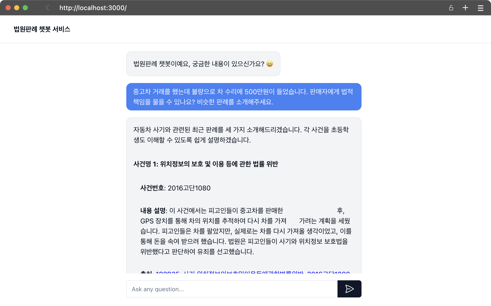

# 법원판례 챗봇 서비스

이 프로젝트는 법원 판례에 대한 질문에 답변하는 AI 챗봇 서비스입니다. Next.js와 FastAPI를 사용하여 구현되었으며, GPT-4o 모델을 활용하여 사용자의 질문에 대한 답변을 생성합니다.



## 주요 기능

- 사용자의 법률 관련 질문에 대한 AI 기반 답변 제공
- 실시간 스트리밍 응답
- 다중 턴 대화 지원
- 판례 검색 및 관련 정보 제공

## 기술 스택

- Frontend: Next.js, React, TypeScript, Tailwind CSS
- Backend: FastAPI, Python
- AI 모델: GPT-4o
- 벡터 데이터베이스: FAISS
- 검색 알고리즘: BM25

## 설치 및 실행

1. 저장소 클론:

```bash
git clone --recurse-submodules git@github.com:anpigon/law-chatbot.git
cd law-chatbot
```
> 만약 `law-bot` 폴더가 비어있다면 다음 명령어를 수행하여 서브모듈을 업데이트 해주세요.
> ```bash
> git submodule init
> git submodule update
> ```

2. 프론트엔드 의존성 설치:

```bash
pnpm install
```

3. 백엔드 의존성 설치:

```bash
poetry install
```

4. 환경 변수 설정:
   `.env` 파일을 생성하고 필요한 환경 변수를 설정합니다.

5. 백엔드 서버 실행:

```bash
poetry run python server.py
```

6. 프론트엔드 개발 서버 실행:

```bash
pnpm dev
```

7. 브라우저에서 `http://localhost:3000`으로 접속하여 서비스 이용

## 프로젝트 구조

- `app/`: Next.js 애플리케이션 코드
- `components/`: React 컴포넌트
- `server.py`: FastAPI 백엔드 서버
- `public/`: 정적 파일

## 라이선스

이 프로젝트는 [LICENSE](LICENSE.txt)에 따라 라이선스가 부여됩니다.
